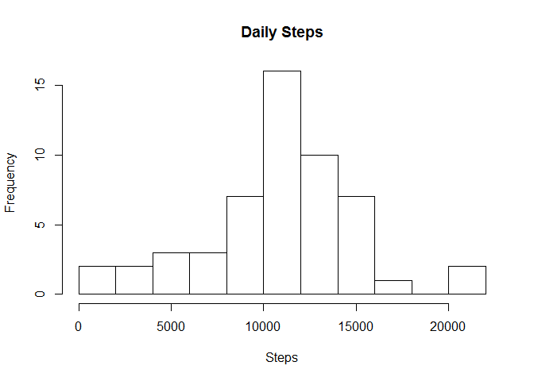
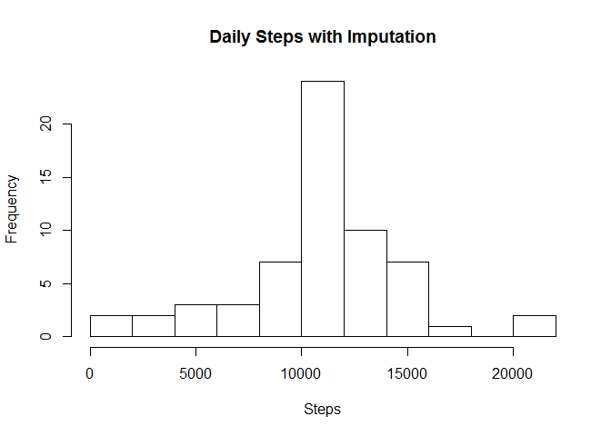
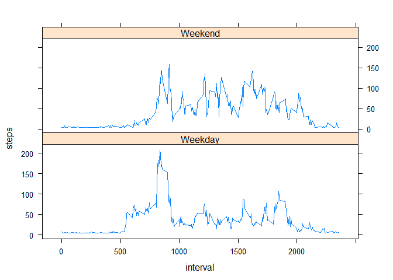

# Reproducible Research: Peer Assessment 1

## Load packages

```r
library(knitr); library(dplyr); library(lubridate); library(ggplot2); library(lattice)
```


## Loading and preprocessing the data

Load the data


```r
activity <- read.table(unzip("activity.zip"), header=T, sep=",")
```


## What is mean total number of steps taken per day?

Plot a histogram of the total # of steps taken each day


```r
stepsDay <- activity %>%
  group_by(date) %>%
  summarize(steps=sum(steps))
hist(stepsDay$steps,  breaks=10, main="Daily Steps", xlab="Steps") #this will leave out any NA days
```

 

## What is the average daily activity pattern?

Calculate the mean and median steps per day


```r
(stepMean <- mean(stepsDay$steps, na.rm=T))
```

```
## [1] 10766.19
```

```r
(stepMedian <- median(stepsDay$steps, na.rm=T))
```

```
## [1] 10765
```

## Imputing missing values

How many missing rows?


```r
sum(is.na(activity))
```

```
## [1] 2304
```

Impute missing values for each day by assigning them the mean # of steps taken. In the data set, an entire day is missing if and only if any 5 minute interval in it is missing.


```r
activityImp  <- activity  #copy the data
fiveMinMean  <- stepMean / 288 #mean for a 5-minute interval, since 288 5-min intervals / day
activityImp$steps <- ifelse(is.na(activityImp$steps), fiveMinMean, activity$steps)
```

Plot a new histogram from the imputed data.


```r
stepsDayImp <- activityImp %>%
  group_by(date) %>%
  summarize(steps=sum(steps, na.rm=T))
hist(stepsDayImp$steps, breaks=10, main="Daily Steps with Imputation", xlab="Steps")
```

 

We can see that imputing the missing values from the mean value increases the size of the central peak. 

Next we calculate the ,ean and median steps / day from imputed data.


```r
(stepMeanImp <- mean(stepsDayImp$steps))
```

```
## [1] 10766.19
```

```r
(stepMedianImp <- median(stepsDayImp$steps))
```

```
## [1] 10766.19
```

As should be expected, the mean is unchanged, and the median shifts towards the mean.

## Are there differences in activity patterns between weekdays and weekends?

First create a factor "dayType" labeling weekend vs weekdays


```r
day <- wday(activityImp$date)
dayType <- factor(ifelse(day %in% c(1,7), "Weekend", "Weekday"))
activityImp <- mutate(activityImp, dayType=dayType)
```

Plot the average across all days, grouped into weekdays and weekends, for each 5-min interval


```r
steps_by_dayType_interval <- activityImp %>%
  group_by(dayType, interval) %>%
  summarize(steps = mean(steps))

with(steps_by_dayType_interval, xyplot(steps ~ interval | dayType, layout=c(1,2), type="l"))
```

 

